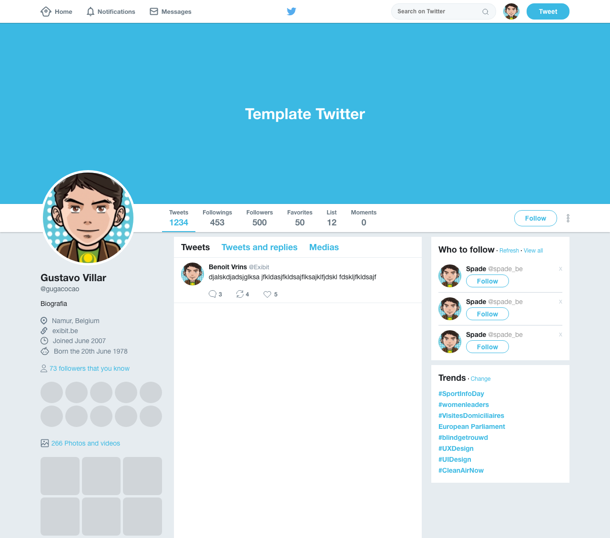

# Flex - CSS3

This is a [rocketseat](https://www.rocketseat.com.br/) learning bonus to understand flex box from CSS3. This challenge help you improve your coding skills by building realistic application.

## Table of contents

- [Overview](#overview)
  - [The challenge](#the-challenge)
  - [Screenshot](#screenshot)
  - [Links](#links)
- [My process](#my-process)
  - [Built with](#built-with)
  - [What I learned](#what-i-learned)
- [Author](#author)

## Overview

### The challenge

Users should be able to:

- Understand how create a interface using flexbox

### Screenshot



### Links

- Solution URL: [Github](https://github.com/gugavillar/twitter)

## My process

To create this application, i use flex from CSS3 and pure CSS

### Built with

- HTML
- CSS3

### What I learned

In this project i was learn how the flexbox works to create the layouts from web, and how can i use for my applications.

```css
header#main-header .content {
  display: flex;
  align-items: center;
  justify-content: space-between;
  height: 100%;
}
```

## Author

- Twitter - [@gugacocao](https://twitter.com/gugacocao)
- Linkedin - [gugavillar](https://www.linkedin.com/in/gugavillar/)
